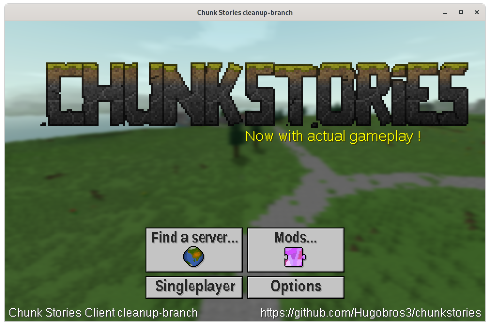
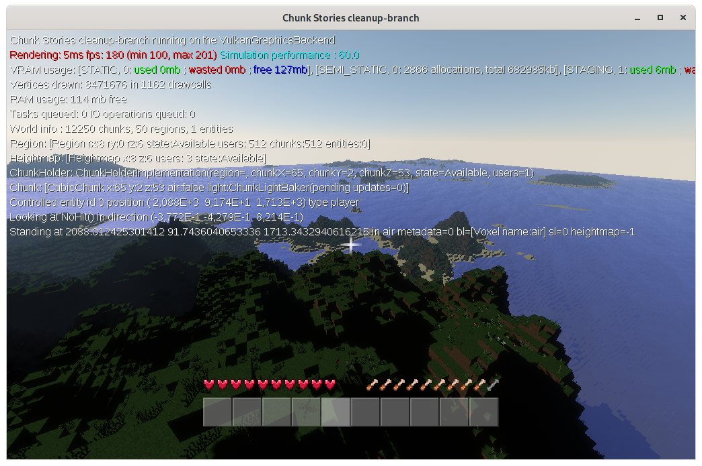

# Chunk Stories

> Important node:
> 
> The current master branch is in heavy work in progress. Many features such as multiplayer and sound are completely non-fonctional as a heavy refactor of the code is occuring. Because of heavy bit-rot, older versions of the game are also no longer usable (largely due to an defunct account system). I have limited time and willpower to spend on this unfortunately, but the refactor should ultimately make it easier going forward, the technical debt is really bad otherwise !



## What is Chunk Stories ?

Chunk Stories is an advanced Minecraft clone, with a tailor-built engine boasting first-class modding support. It is written in Kotlin and tries to emulate the appeal of the proprietary Java Edition, but as free software and built in a more modern, and a more modular architecture. The engine features modern features such as a Vulkan rendering backend and a traits-based system for entities, and the developpers adopt a pragmatic approach to code complexity and technical challenges.

### Why yet another Minecraft clone ?

Not everyone is happy with the direction Minecraft is taking under the direction of Microsoft. ~~While the game is doing very well for now,~~ (See edit later) it's clear Redmont wants to keep an iron grip over it's modding potential, and refuses to provide a real modding API with a permissive licensing scheme. There is also the issue of the Bedrock edition, which is a dystopian version of the game, complete with paid mods, microtransactions and completely locked-down executables, which threatens to replace the good old Java Edition over time. 

**Edit 2020.12.02: Unfortunately this threat is now a much more concrete one with the move to Microsoft accounts forcing players to submit to very problematic terms of service if they do not want to give up their access to the game, further highliting the importance of a free (as in beer) alternative.**

Chunk Stories is free software and runs on any platform someone can be bothered to port the implementation to.

### You didn't answer the question, there already are multiple open minecraft clones!

For the author, Chunk Stories is and always has been a side project, made for fun and to become a better programmer. The author also finds the existing offerings poor, and has the smug belief he can do better, especially in the mods handling department ([Yes, that](https://xkcd.com/927/)).

To this end, Chunk Stories borrows heavily from one of two best things about the Minecraft modding ecosystem: The Bukkit-style of plugins, and the server-downloadable "resource packs", mixing the two into the idea of a "Mod". Mods are merely zip files with resources ( images, 3d models, sounds, json files ) and code ( inside jars ), and are very simple to both build and use.



## Main engine features

 * Uses [hjson](https://hjson.org/) for content definitions (Blocks, Items, Entities, Particles, etc)
 * Support for hot-(re)loading mods
 * Advanced graphics with a rendergraph-based renderer
    * **Vulkan** and OpenGL 3.3 backends
    * Very high view distances, to 1km and above via heightmaps
    * Simple data-oriented API for having objects drawn on the screen and passing data to shaders
    * Experimental voxel global illumination\*
 * Multiplayer, with dedicated servers and the ability to serve mods
 * Entities use traits to store data and organize their logic
 * DPI-agnostic UI with seamless scaling
 * Sane-ish codebase thanks to *years* of bikeshedding and refactoring

\* some stuff *might* not be quite done right now

# Links

 * To learn how to play the game and register an account, please visit http://chunkstories.xyz
 * You can find a lot more information on the game wiki, including guides to writing mods, at http://chunkstories.xyz/wiki/
 * You can find videos and dev logs on the lead developer youtube channel: http://youtube.com/Hugobros3
 * We have a discord where anyone can discuss with the devs: https://discord.gg/wudd4pe
 * You can get support either by opening a issue on this project or by visiting the subreddit over at https://reddit.com/r/chunkstories

# Building

*This is for building `chunkstories`, the core engine. If you are only looking to write mods, you do not have to mess with this at all and should rather follow the [mods creation guide](http://chunkstories.xyz/wiki/doku.php?id=mod_setup) on the project Wiki !*

## Setup

### Video tutorial

[](https://www.youtube.com/watch?v=uLigFN8id3c)

### Brief Instructions

First you need to clone both `chunkstories-api` and `chunkstories-core` as both are needed to compile this. You can try to build from the artifacts in the repo, but only those used in released versions of the games are guaranteed to be present.
 * `git clone` both `chunkstories-api` and `chunkstories-core`
 * in the chunkstories-api folder: `./gradlew install` or `gradlew.exe install`on Windows
 * in the chunkstories-core folder: `./gradlew install` or `gradlew.exe install`on Windows

The local maven repository on your computer (.m2 folder) now contains copies of both the api and core content the chunkstories engine requires. These are not automatically rebuilt when building the implementation as they are completly seperate projects, so keep that in mind.

#### Gradle Tasks

 * `./gradlew client:shadowJar` builds the Client executable (chunkstories.jar)
 * `./gradlew server:shadowJar` builds the Server executable (server.jar)
 * `./gradlew converter:shadowJar` builds the Map converter executable (converter.jar)
 * `./gradlew launcher:createExe` builds the launcher executables (.exe and .jar as well)
 * `./gradlew buildAll` builds all of the above

### Make it work with OS X

In order to launch ChunkStories on OS X (tested only on 10.11), you need to follow steps above, and use following command line arguments:

```sh
# At least 2GB of RAM
java -XstartOnFirstThread -Djava.awt.headless=true -Xmx2G -jar client/build/libs/chunkstories.jar --backend=OPENGL --core=../chunkstories-core/res/
```

# License

The chunkstories **implementation** is released under LGPL, see LICENSE.MD

# Code of Conduct

We haven't yet adopted a CoC as to us it would come off more as a political statement than anything else at this point, given the small size of this project. In general we'd like to keep this space safe from extremely polarized political flamewars, and ideally everyone would put their differences aside within this project. So don't be a jerk, exercise some empathy, verbal restraint and try to understand where others are coming from.
